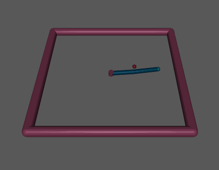

<h1 align="center">
  <picture>
    <source media="(prefers-color-scheme: dark)" srcset="./assets/evox_brand_dark.svg">
    <source media="(prefers-color-scheme: light)" srcset="./assets/evox_brand_dark.svg">
    
  </picture>
</h1>


<h2 align="center">
  <p>🌟 MetaDE: Evolving Differential Evolution by Differential Evolution 🌟</p>
  <a href="https://arxiv.org/abs/2502.10470">
    
  </a>
</h2>

MetaDE is an advanced evolutionary framework that dynamically optimizes the strategies and hyperparameters of Differential Evolution (DE) through meta-level evolution. By leveraging DE to fine-tune its own configurations, MetaDE adapts mutation and crossover strategies to suit varying problem landscapes in real-time. With GPU acceleration, it handles large-scale, complex black-box optimization problems efficiently, delivering faster convergence and superior performance. MetaDE is compatible with the <a href="https://github.com/EMI-Group/evox">EvoX</a> framework.

> **New in this version**:
>
> MetaDE now fully supports both **JAX** and **PyTorch** backends.
>
> - **PyTorch backend updates:**
>   - Now supports **Brax-based RL tasks**(requires additional installation of JAX).
>   - Significant performance improvements when used with **EvoX v1.1.1**, achieving up to **2x speedup** compared to previous versions.
>   - Strongly recommended to use **EvoX 1.1.1** and GPU-enabled PyTorch for optimal performance.
>
> - **JAX backend:**
>   - Remains fully supported and recommended if you prefer CUDA-enabled JAX.
>   - Generally offers approximately **2x the speed** compared to the PyTorch backend.

To replicate experiments from the paper exactly, you may still opt for the JAX backend with a CUDA-enabled JAX (and Brax) installation.

## Features

- **Meta-level Evolution** 🌱: Uses DE at a meta-level to evolve hyperparameters and strategies of DE applied at a problem-solving level.
- **Parameterized DE (PDE)** 🛠️: A customizable variant of DE that offers dynamic mutation and crossover strategies adaptable to different optimization problems.
- **Multi-Backend Support** 🔥: Provides both JAX and PyTorch implementations for broader hardware/software compatibility.
- **GPU-Accelerated** 🚀: Integrated with GPU acceleration on both JAX and PyTorch, enabling efficient large-scale optimizations.
- **End-to-End Optimization** 🔄: MetaDE provides a seamless workflow from hyperparameter tuning to solving optimization problems in a fully automated process.
- **Wide Applicability** 🤖: Supports various benchmarks, including CEC2022, and real-world tasks like evolutionary reinforcement learning in robotics.

## RL Tasks Visualization

Using the MetaDE algorithm to solve RL tasks.

The following animations show the behaviors in Brax environments:

<table width="81%">
  <tr>
    <td width="27%">
      
    </td>
    <td width="27%">
      
    </td>
    <td width="27%">
      
    </td>
  </tr>
  <tr>
    <td align="center">
      Hopper
    </td>
    <td align="center">
      Swimmer
    </td>
    <td align="center">
      Reacher
    </td>
  </tr>
</table>

- **Hopper**: Aiming for maximum speed and jumping height.  
- **Swimmer**: Enhancing movement efficiency in fluid environments.  
- **Reacher**: Moving the fingertip to a random target.

## Requirements

Depending on which backend you plan to use (JAX or PyTorch), you should install the proper libraries and GPU dependencies:

- **Common**:
  - [evox](https://github.com/EMI-Group/evox) (version **== 1.1.1** for PyTorch support)
  - `brax == 0.10.3` (optional, if you want to run Brax RL problems)
  
- **JAX**-based version:
  - `jax >= 0.4.16`
  - `jaxlib >= 0.3.0`

- **PyTorch**-based version:
  - `torch` (GPU version recommended, e.g. `torch>=2.5.0`)
  - `torchvision`, `torchaudio` (optional, depending on your environment/needs)

## Installation

You can install MetaDE with either the JAX or PyTorch backend (or both).  
Below are some example installation steps; please adapt versions as needed:

### Option A: Install for PyTorch Only

1. **Install [PyTorch](https://pytorch.org/get-started/locally/)** (with CUDA, if you want GPU acceleration). For example, if you have CUDA 12.4, you might do:
   ```bash
   pip install torch torchvision torchaudio --index-url https://download.pytorch.org/whl/cu124
2. **Install EvoX == 1.1.1** (for PyTorch support):
   ```bash
   pip install git+https://github.com/EMI-Group/evox.git@v1.1.1
3. **Install MetaDE**:
   ```bash
   pip install git+https://github.com/EMI-Group/metade.git
   ```
4. **Install Brax**(Optional, if you want to solve Brax RL problems, also requires JAX installation):):
   ```bash
   pip install brax==0.10.3
   pip install -U jax[cuda12]
   ```
   
### Option B: Install for JAX Only

1. **Install [JAX](https://github.com/google/jax)**. We recommend `jax >= 0.4.16`.

    For cpu version only, you may use:
    ```bash
    pip install -U jax
    ```
    For nvidia gpus, you may use:
    ```bash
    pip install -U jax[cuda12]
    ```
    For details of installing jax, please check https://github.com/google/jax.
2. **Install EvoX == 1.1.1** (for PyTorch support):
   ```bash
   pip install git+https://github.com/EMI-Group/evox.git@v1.1.1
3. **Install MetaDE**:
   ```bash
   pip install git+https://github.com/EMI-Group/metade.git
   ```
4. **Install Brax**(Optional, if you want to solve Brax RL problems):
   ```bash
   pip install brax==0.10.3
   ```


## Components

### Evolver
MetaDE employs Differential Evolution (DE) as the evolver to optimize the parameters of its executor.

- **Mutation**: DE's mutation strategies evolve based on feedback from the problem landscape.
- **Crossover**: Different crossover strategies (binomial, exponential, arithmetic) can be used and adapted.


### Executor
The executor is a **Parameterized Differential Evolution (PDE)**, a variant of DE designed to accommodate various mutation and crossover strategies dynamically.

- **Parameterization**: Flexible mutation strategies like `DE/rand/1/bin` or `DE/best/2/exp` can be selected based on problem characteristics.
- **Parallel Execution**: Core operations of PDE are optimized for parallel execution on GPUs(via JAX or PyTorch).


### GPU Acceleration
MetaDE integrates with the EvoX framework for distributed, GPU-accelerated evolutionary computation, significantly enhancing performance on large-scale optimization tasks.

## Examples

### Global Optimization Benchmark Functions
```python
import jax.numpy as jnp
import jax
from tqdm import tqdm

from metade.util import StdSOMonitor, StdWorkflow
from metade.algorithms.jax import create_batch_algorithm, decoder_de, MetaDE, ParamDE, DE
from metade.problems.jax.sphere import Sphere

D = 10
BATCH_SIZE = 100
NUM_RUNS = 1
key_start = 42

STEPS = 50
POP_SIZE = BATCH_SIZE

BASE_ALG_POP_SIZE = 100
BASE_ALG_STEPS = 100

tiny_num = 1e-5
param_lb = jnp.array([0, 0, 0, 0, 1, 0])
param_ub = jnp.array([1, 1, 4 - tiny_num, 4 - tiny_num, 5 - tiny_num, 3 - tiny_num])

evolver = DE(
    lb=param_lb,
    ub=param_ub,
    pop_size=POP_SIZE,
    base_vector="rand",
    differential_weight=0.5,
    cross_probability=0.9
)

BatchDE = create_batch_algorithm(ParamDE, BATCH_SIZE, NUM_RUNS)
batch_de = BatchDE(
    lb=jnp.full((D,), -100),
    ub=jnp.full((D,), 100),
    pop_size=BASE_ALG_POP_SIZE,
)

base_problem = Sphere()
decoder = decoder_de
key = jax.random.PRNGKey(key_start)

monitor = StdSOMonitor(record_fit_history=False)

meta_problem = MetaDE(
    batch_de,
    base_problem,
    batch_size=BATCH_SIZE,
    num_runs=NUM_RUNS,
    base_alg_steps=BASE_ALG_STEPS
)

workflow = StdWorkflow(
    algorithm=evolver,
    problem=meta_problem,
    pop_transform=decoder,
    monitor=monitor,
    record_pop=True,
)

key, subkey = jax.random.split(key)
state = workflow.init(subkey)

power_up = 0
last_iter = False

for step in tqdm(range(STEPS)):
    state = state.update_child("problem", {"power_up": power_up})
    state = workflow.step(state)

    if step == STEPS - 1:
        power_up = 1
        if last_iter:
            break
        last_iter = True

print(f"Best fitness: {monitor.get_best_fitness()}")
```
> If you want to use the PyTorch backend, please refer to the PyTorch examples under `examples/pytorch/example.py` in this repository.

### CEC Benchmark Problems

MetaDE supports several benchmark suites such as CEC2022. Here’s an example (JAX-based) for the CEC2022 test suite:

```python
import jax.numpy as jnp
import jax
from tqdm import tqdm
from metade.util import (
    StdSOMonitor,
    StdWorkflow
)
from metade.algorithms.jax import create_batch_algorithm, decoder_de, MetaDE, ParamDE, DE
from metade.problems.jax import CEC2022TestSuit

D = 10 
FUNC_LIST = jnp.arange(12) + 1
BATCH_SIZE = 100
NUM_RUNS = 1  
key_start = 42

STEPS = 50
POP_SIZE = BATCH_SIZE

BASE_ALG_POP_SIZE = 100
BASE_ALG_STEPS = 100  

tiny_num = 1e-5
param_lb = jnp.array([0, 0, 0, 0, 1, 0])
param_ub = jnp.array([1, 1, 4 - tiny_num, 4 - tiny_num, 5 - tiny_num, 3 - tiny_num])

evolver = DE(
    lb=param_lb,
    ub=param_ub,
    pop_size=POP_SIZE,
    base_vector="rand", differential_weight=0.5, cross_probability=0.9
)

BatchDE = create_batch_algorithm(ParamDE, BATCH_SIZE, NUM_RUNS)
batch_de = BatchDE(
    lb=jnp.full((D,), -100),
    ub=jnp.full((D,), 100),
    pop_size=BASE_ALG_POP_SIZE,
)

for func_num in FUNC_LIST:
    base_problem = CEC2022TestSuit.create(int(func_num))
    decoder = decoder_de
    key = jax.random.PRNGKey(key_start)

    monitor = StdSOMonitor(record_fit_history=False)
    print(type(base_problem).__name__)
    meta_problem = MetaDE(
        batch_de,
        base_problem,
        batch_size=BATCH_SIZE,
        num_runs=NUM_RUNS,
        base_alg_steps=BASE_ALG_STEPS
    )

    workflow = StdWorkflow(
        algorithm=evolver,
        problem=meta_problem,
        pop_transform=decoder,
        monitor=monitor,
        record_pop=True,
    )
    key, _ = jax.random.split(key)
    state = workflow.init(key)

    power_up = 0
    last_iter = 0

    for i in tqdm(range(STEPS)):
        state = state.update_child("problem", {"power_up": power_up})
        state = workflow.step(state)

        if i == STEPS - 1:
            power_up = 1
            if last_iter:
                break
            last_iter = 1
        steps_iter = i + 1

    print(f"Best_fitness: {monitor.get_best_fitness()}")
```
> If you want to use the PyTorch backend, please refer to the PyTorch examples under `examples/pytorch/example_cec2022.py` in this repository.
> 
### Robotics Control (Evolutionary Reinforcement Learning)

MetaDE can also be used for real-world tasks like robotic control through evolutionary reinforcement learning. Note that running these examples requires installing CUDA-enabled JAX and `brax==0.10.3`.
```python
from tqdm import tqdm
import metade.problems
from jax import random
from flax import linen as nn
import jax.numpy as jnp
import jax

from metade.util import StdSOMonitor, StdWorkflow, TreeAndVector, parse_opt_direction
from metade.algorithms.jax import create_batch_algorithm, decoder_de, MetaDE, ParamDE, DE

steps = 20
pop_size = 100
key = jax.random.PRNGKey(42)

class HopperPolicy(nn.Module):
    @nn.compact
    def __call__(self, x):
        x = x.astype(jnp.float32)
        x = x.reshape(-1)
        x = nn.Dense(32)(x)
        x = nn.tanh(x)
        x = nn.Dense(32)(x)
        x = nn.tanh(x)
        x = nn.Dense(3)(x)
        x = nn.tanh(x)
        return x

model = HopperPolicy()
weights = model.init(random.PRNGKey(42), jnp.zeros((11,)))
adapter = TreeAndVector(weights)
vector_form_weights = adapter.to_vector(weights)

tiny_num = 1e-5
param_lb = jnp.array([0, 0, 0, 0, 1, 0])
param_ub = jnp.array([1, 1, 4 - tiny_num, 4 - tiny_num, 5 - tiny_num, 3 - tiny_num])
algorithm = DE(
    lb=param_lb,
    ub=param_ub,
    pop_size=pop_size,
    base_vector="rand", differential_weight=0.5, cross_probability=0.9
)

BatchDE = create_batch_algorithm(ParamDE, pop_size, 1)
batch_de = BatchDE(
    lb=jnp.full((vector_form_weights.shape[0],), -10.0),
    ub=jnp.full((vector_form_weights.shape[0],), 10.0),
    pop_size=100,
)

base_problem = metade.problems.jax.Brax(
    env_name="hopper",
    policy=jax.jit(model.apply),
    cap_episode=500,
)

meta_problem = MetaDE(
    batch_de,
    base_problem,
    batch_size=pop_size,
    num_runs=1,
    base_alg_steps=50,
    base_opt_direction="max",
    base_pop_transform=adapter.batched_to_tree,
)

monitor = StdSOMonitor(record_fit_history=False)
workflow = StdWorkflow(
    algorithm=algorithm,
    problem=meta_problem,
    monitor=monitor,
    pop_transform=decoder_de,
    record_pop=True,
)
monitor.set_opt_direction(parse_opt_direction("max"))
key, _ = jax.random.split(key)
state = workflow.init(key)

for i in tqdm(range(steps)):
    power_up = 1 if i == steps - 1 else 0
    state = state.update_child("problem", {"power_up": power_up})
    state = workflow.step(state)

print(f"Best fitness: {monitor.get_best_fitness()}")
```
> If you want to use the PyTorch backend, please refer to the PyTorch examples under `examples/pytorch/example_brax.py` in this repository.


## Community & Support

- Engage in discussions and share your experiences on [GitHub Discussion Board](https://github.com/EMI-Group/evox/discussions).
- Join our QQ group (ID: 297969717).

## Citing MetaDE
```
@article{metade,
  title = {{MetaDE}: Evolving Differential Evolution by Differential Evolution},
  author = {Chen, Minyang and Feng, Chenchen and Cheng, Ran},
  journal = {IEEE Transactions on Evolutionary Computation},
  year = 2025,
  doi = {10.1109/TEVC.2025.3541587}
}
```
